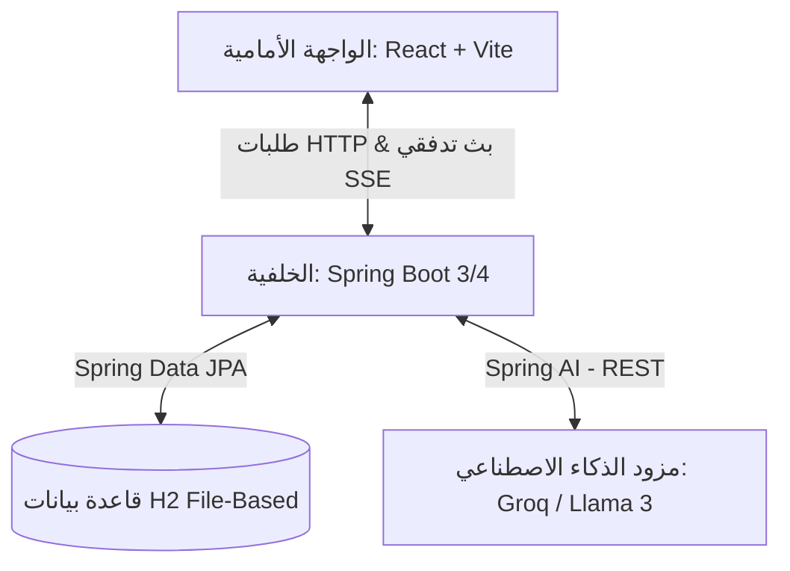
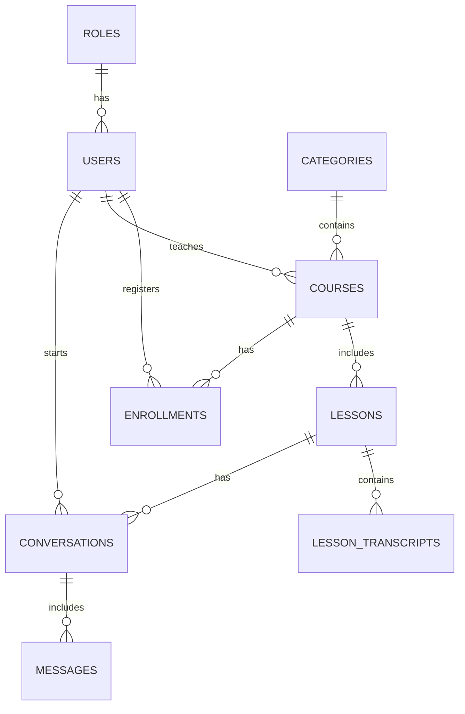
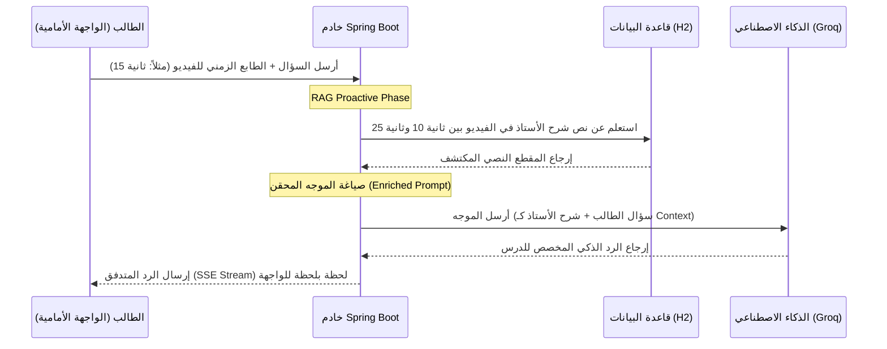

# 🎓 دليل التوثيق الأكاديمي لمشروع التخرج: Next Generation Learning Platform (NGLP)

مرحباً بك في الدليل المرجعي والأكاديمي الشامل لمنصة **NGLP (Next Generation Learning Platform)**. تم تصميم وكتابة هذا الدليل ليكون مرجعاً مسانداً لك عند كتابة كتاب التخرج وإعداد العرض التقديمي (Slides) أمام لجنة المناقشة والحكم، حيث يشرح بنية النظام المعمارية، وتكامل الذكاء الاصطناعي، وتصميم قاعدة البيانات والـ APIs بالتفصيل.

---

## 🏛️ 1. البنية المعمارية للنظام (System Architecture)

يعتمد المشروع على بنية معمارية منفصلة ومرنة للغاية (Decoupled Client-Server Architecture) تسهل صيانتها وتطويرها وتضمن كفاءة عالية في الأداء:



### أ. الواجهة الأمامية (Frontend):
* **التقنيات المستخدمة:** React.js, Vite (للبناء السريع واللحظي)، Vanilla CSS (لتصميم مرن، حديث، وبدون تعقيد).
* **نمط الصفحة الواحدة (SPA):** توفير تجربة مستخدم سلسة وفائقة السرعة تحاكي تطبيقات سطح المكتب.
* **مشغل الفيديو التفاعلي:** مشغل مخصص يرسل إشارات الطابع الزمني (Timestamps) لحظياً ليتزامن معها المساعد الذكي.

### ب. الخلفية (Backend):
* **التقنيات المستخدمة:** Spring Boot (Java 20/25)، Spring Security (لحماية المسارات والمصادقة)، Spring Data JPA (للتعامل مع جداول قاعدة البيانات).
* **Spring AI:** المكتبة الرسمية من Spring لربط النماذج اللغوية الضخمة (LLMs) برمجياً وسحب الإجابات وتدفقها.

### ج. قاعدة البيانات (Database):
* **التقنية:** **H2 Database (Persistent File-Based Mode)**.
* **ميزة استراتيجية للمناقشة:** تم تصميم قاعدة البيانات لتخزن في ملف محلي `./data/nglp_db` داخل مجلد المشروع. هذا يعني أنه يمكنك تشغيل الكود كاملاً واستعراض كافة البيانات التي أدخلتها أمام اللجنة على أي كمبيوتر محمول بضغطة زر واحدة ودون الحاجة لتنصيب خادم MySQL أو فقدان البيانات عند إغلاق التطبيق.

---

## 💾 2. مخطط وهيكلية قاعدة البيانات (Database Schema)

تتألف قاعدة البيانات من 8 جداول رئيسية مرتبطة بعلاقات متكاملة لخدمة العملية التعليمية:



### تفاصيل الجداول والأعمدة:
1. **الأدوار (roles):** لتحديد الصلاحيات في النظام (طالب، معلم، مشرف).
2. **المستخدمون (users):** لحفظ بيانات الطلاب والمعلمين والمشرفين (الاسم الكامل، البريد الإلكتروني، كلمة المرور المشفرة بـ BCrypt).
3. **التصنيفات (categories):** لفرز الكورسات وتصنيفها شجرياً (مثل: برمجة -> واجهات أمامية).
4. **الكورسات (courses):** لتعريف المناهج الدراسية، وترتبط بالمعلم والتصنيف.
5. **الدروس (lessons):** لحفظ الفيديوهات وعناوين الدروس ومدتها داخل كل كورس.
6. **التفريغ النصي للدروس (lesson_transcripts):** جدول عبقري يحفظ نصوص المعلم المنطوقة مقسمة زمنياً (بداية بالثواني، ونهاية بالثواني) لخدمة محرك البحث الذكي.
7. **الاشتراكات (enrollments):** لمتابعة تقدم الطالب في كل كورس، وتخزين نسبة الإنجاز والدرس الأخير المشاهد (`last_watched_lesson_id`).
8. **المحادثات والرسائل (conversations & messages):** لحفظ محادثات الطالب مع المساعد الذكي لكل درس، مما يمكنه من استئناف دردشته في أي وقت.

---

## 🤖 3. معمارية محرك الذكاء الاصطناعي التوليدي والـ RAG

أبرز نقاط القوة الأكاديمية في هذا المشروع هي معمارية **RAG (Retrieval-Augmented Generation)** المبتكرة للـ AI Tutor:



### مميزات هذه المعمارية أمام لجنة التحكيم:
1. **الذكاء الاستباقي (Proactive RAG):** لا ينتظر النظام قيام الـ LLM باستدعاء أدوات خارجية (والذي يؤدي لبطء شديد وتوقف الرد التدفقي)، بل يقوم السيرفر بذكاء باستخلاص مقطع الشرح المطابق للثانية الحالية للفيديو من قاعدة البيانات ويحقنه فوراً كـ Context.
2. **البث اللحظي الحقيقي (Server-Sent Events - SSE):** تتدفق الإجابة للطالب حرفاً بحرف مما يعطي واجهة مستخدم فائقة التفاعل تشبه ChatGPT.
3. **ميزة التصفية التلقائية للرسائل (Smart Slicing):** يقوم السيرفر عند حفظ الذاكرة بتنظيف رسائل الطالب وحذف السياق الفني المساعد المحقن، لكي تظل قاعدة البيانات والتاريخ معروضين بشكل نظيف وبسيط للمستخدم.

---

## 🔗 4. دليل نقاط الاتصال البرمجية (REST API Endpoints)

تم بناء الـ APIs وتنظيمها وتأمينها بالكامل باستخدام معايير RESTful القياسية:

### أ. نظام الحماية والمصادقة (Authentication):
* **`POST /api/v1/auth/login`**: للتحقق من بيانات المستخدم وإدخاله للنظام.
* **`POST /api/v1/auth/register`**: لتسجيل حساب طالب جديد وحفظ كلمته مشفرة.

### ب. إدارة الكورسات والدروس (Courses & Lessons):
* **`GET /api/v1/courses`**: جلب كافة الكورسات المتاحة.
* **`GET /api/v1/courses/{id}`**: جلب تفاصيل كورس محدد.
* **`GET /api/v1/lessons`**: استعلام الدروس التابعة لكورس معين باستخدام `?courseId=x`.
* **`GET /api/v1/lessons/{id}`**: جلب تفاصيل درس معين والمسار المرئي للفيديو.

### ج. لوحة الطالب والتقدم الدراسية (Enrollments):
* **`GET /api/v1/enrollments`**: جلب قائمة الكورسات التي سجل فيها الطالب ونسبة إنجازه.
* **`POST /api/v1/enrollments`**: تسجيل الطالب في كورس جديد.
* **`PUT /api/v1/enrollments/{id}/progress`**: تحديث نسبة التقدم وتحديد آخر درس تمت مشاهدته تلقائياً عند حضور الفيديوهات.

### د. المساعد الذكي والتاريخ (AI Tutor Conversations):
* **`GET /api/v1/conversations/history`**: جلب تاريخ الرسائل المتبادلة بين الطالب والـ AI للدرس الحالي بطلب واحد مبسط `?userId=x&lessonId=y`.
* **`GET /api/v1/ai/stream`**: نقطة بث الردود اللحظية التدفئية (Streaming Endpoint) وتدعم معايير `text/event-stream`.

### هـ. نقاط التحكم الإشرافية المؤمنة (Secured Admin Endpoints):
* **`PUT /api/v1/users/{id}/admin`**: ترقية دور العضو أو حظر حسابه مؤقتاً (مؤمن ومحمي للمشرفين فقط).
* **`DELETE /api/v1/users/{id}`**: حذف مستخدم نهائياً من قاعدة البيانات (للمشرفين فقط).
* **`POST /api/v1/categories`**: إنشاء تصنيف أكاديمي جديد (رئيسي أو فرعي) (للمشرفين فقط).
* **`PUT /api/v1/categories/{id}`**: تعديل مسمى قسم أو إعادة توجيهه (للمشرفين فقط).
* **`DELETE /api/v1/categories/{id}`**: حذف تصنيف دراسي فارغ (للمشرفين فقط).

---

## 🛠️ 5. الهندسة البرمجية الاستثنائية في المشروع (Architecture Highlights)

أثناء بناء المنصة، تم تضمين حلول وحيل برمجية استثنائية تعزز من القيمة البرمجية للمشروع أمام خبراء لجان المناقشة:

### 1. التسجيل الديناميكي للواجهات بالانعكاس (Dynamic Reflection Servlet Registration):
لتجنب تضارب التبعيات ومشاكل المترجم (Compiler Scope) مع قاعدة البيانات H2، تم تسجيل واجهة تصفح الويب لقاعدة البيانات عبر الانعكاس البرمجي لتعمل ديناميكياً في مرحلة التشغيل فقط:
```java
Class<?> servletClass = Class.forName("org.h2.server.web.JakartaWebServlet");
```

### 2. التجاوز الآمن لفلاتر الحماية (Security Bypass Customizer):
تم تكوين Spring Security ليتجاهل تماماً واجهة تصفح قاعدة البيانات H2 لتمكين المطور من إدخال البيانات دون أي تعارض مع الجلسات الـ Stateless وفلاتر حماية الـ CSRF:
```java
web.ignoring().requestMatchers("/h2-console/**")
```

### 3. تأمين خادم REST اللامتناهي عبر الهيدر المخصص (Stateless Custom Header Verification):
نظراً لاعتماد خلفية النظام على جلسات غير محفوظة الحالة (Stateless Sessions) لدعم معايير التوسع الأفقي، قمنا بابتكار وتطبيق نظام مصادقة خفيف يعتمد على حقن هيدر الطلب `X-User-Role` من خلال Axios Interceptors في الواجهة الأمامية، ومن ثم مطابقتها برمجياً في دوال الـ Controller بالخلفية لرفض أي طلبات مشبوهة أو خارجية بـ `403 Forbidden` في حال عدم تطابق الدور مع `ROLE_ADMIN`.

---

مع تمنياتنا لك بمناقشة مشروع تخرج ممتعة ومبهرة للجنة التحكيم! 🚀
